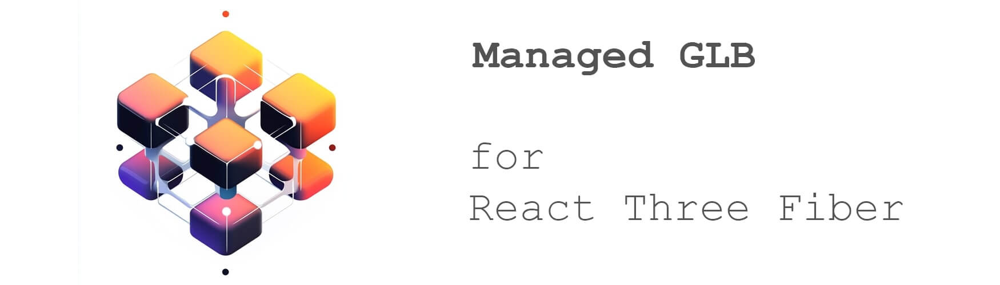

# Managed GLB for React Three Fiber

Wrapper around the gbl/gltf loader that allows handling and customizing only selected nodes in JSX
instead of generating the full JSX file.

# Installation

```bash
npm i --save r3f-managed-glb

yarn add r3f-managed-glb
```

# Usage

```javascript
import { ManagedGLB, meshesInNodeByCount, preloadGLB } from 'r3f-managed-glb';
```

## Handling nodes:

The render function will called with 2 arguments:

- Node - Node component (Mesh or Group)
- node - threejs node object

You able to override any props of the actual {Node}, set or get variables directly from {node}
object or just replace the node with anything you like. Just provide the {custom} prop contains the
struct with description of those nodes

```
 ['<node_name>'] : (Node, node) => (<Node />)  // render function
```

```javascript
import React from 'react';
import { ManagedGLB, meshesInNodeByCount, preloadGLB } from 'r3f-managed-glb';
import * as THREE from 'three';

const glb = 'assets/model.glb';

const splitedMeshesSelector = meshesInNodeByCount('node', 5);

export const MyModel = (props) => {
  const custom = {
    // change material:
    ['node_001']: (Node) => (
      <Node>
        <meshStandardMaterial transparent opacity={0.1} side={THREE.DoubleSide} />
      </Node>
    ),

    // change scale (position, rotation, etc.):
    ['node_002']: (Node) => <Node scale={0.1} />,

    // remove node:
    ['node_003']: () => null,

    // hide node:
    ['node_004']: (Node) => <Node visible={false} />,

    // several nodes selection
    ['node_4|node_5|node_6']: (Node) => <Node />,

    // you can generate selector with function meshesInNodeByCount('node', 5) //(parentNodeName, children count), it return "node_1|node_2|node_3|node_4|node_5". It useful for meshes splited by glb format
    [splitedMeshesSelector]: (Node) => (
      <Node>
        <meshStandardMaterial transparent opacity={0.1} side={THREE.DoubleSide} />
      </Node>
    ),

    // dublicate node:
    ['node_005']: (Node, node) => {
      const pos = [...node.position];
      pos[1] += 2;
      return (
        <>
          <Node />
          <Node position={pos} />
        </>
      );
    }
  };

  return <ManagedGLB src={glb} custom={custom} {...props} />;
};

preloadGLB(glb); // optional, just useGLTF.preload() function
```

## Play animations from glb file:

```javascript
import { ManagedGLB } from './ManagedGLB';
import React, { useRef } from 'react';

const glb = 'assets/animated_model.glb';

export const Anim = ({ parts, ...props }) => {
  const actionsRef = useRef();

  const custom = {
    ['node_001']: (Node) => <Node onClick={() => actionsRef.current['my_action'].play()} />
  };

  return (
    <ManagedGLB
      onInit={({ actions }) => (actionsRef.current = actions)}
      src={glb}
      custom={custom}
      {...props}
    />
  );
};
```

# Build package

1. `git clone git@github.com:dsdevgit/r3f-managed-glb.git`
2. `cd r3f-managed-glb`
3. `yarn`
4. `yarn build`

## TODO:

- Replace examples with TS version
- Add Demo project
